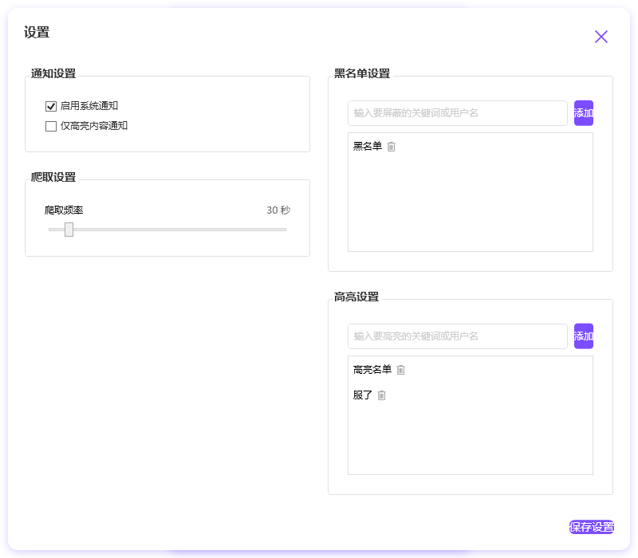

# Zuanke8 Monitor

一个用于监控赚客吧（zuanke8）论坛帖子的 WPF 桌面应用。

## 免责声明

本项目仅供学习和技术研究使用：
- 项目中的所有内容均来自网络公开内容
- 不得用于任何商业用途
- 使用本项目造成的任何问题由使用者自行承担
- 如果本项目侵犯了您的权益，请联系我们删除

## 功能特点

- 实时监控论坛新帖
- 支持关键词过滤（黑名单）
- 支持关键词高亮
- 系统通知提醒
- 自定义刷新频率
- 现代化 UI 设计
- 配置持久化存储

## 界面预览

### 主界面

### 设置界面

## 使用说明

1. 主界面显示最新帖子列表
2. 点击设置按钮可以：
   - 设置爬取频率
   - 管理黑名单关键词
   - 管理高亮关键词
   - 配置通知选项

## 技术特点

- 基于 .NET 6.0
- WPF MVVM 架构
- 现代化 UI 设计
- 配置文件持久化
- 实时数据更新

## 开发环境

- Visual Studio 2022
- .NET 6.0
- Windows 10/11

## 安装说明

1. 克隆仓库