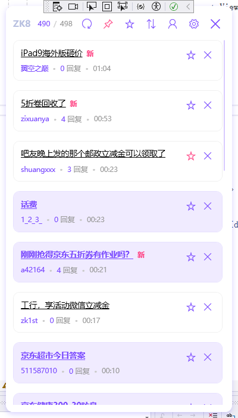

# ZK8 Monitor

一个用于监控赚客吧（zuanke8）论坛帖子的 WPF 桌面应用。

## 界面预览

## 功能特点

- 实时监控论坛新帖
- 支持关键词过滤（黑名单）
- 支持关键词高亮
- 支持帖子收藏
- 支持帖子隐藏
- 支持窗口置顶
- 支持按发帖时间/回复时间排序
- 支持无限滚动加载
- 自定义刷新频率
- 现代化 UI 设计
- 配置持久化存储

## 主要功能说明

### 帖子管理
- 点击帖子可在默认浏览器中打开
- 点击收藏按钮可收藏帖子
- 点击关闭按钮可隐藏帖子
- 新帖子会显示"新"标记
- 支持按发帖时间或最后回复时间排序

### 界面功能
- 支持窗口置顶
- 支持最小化到托盘
- 支持无限滚动加载更多
- 支持手动刷新
- 显示未读/总数统计

### 设置选项
- 自定义爬取频率
- 管理黑名单关键词
- 管理高亮关键词
- 配置通知选项

## TODO 功能列表

### 通知功能
- [ ] 高亮帖子出现时发送系统通知
- [ ] 通知点击直接打开帖子
- [ ] 通知声音提醒
- [ ] 通知免打扰时段设置

### 其他计划
- [ ] 帖子内容预览
- [ ] 帖子分类标签
- [ ] 导出收藏帖子
- [ ] 历史记录查看
- [ ] 多账号切换

## 技术特点

- 基于 .NET 6.0
- WPF MVVM 架构
- 现代化 UI 设计
- 配置文件持久化
- 实时数据更新
- WebView2 登录集成

## 开发环境

- Visual Studio 2022
- .NET 6.0
- Windows 10/11

## 依赖项

- Microsoft.Web.WebView2
- System.Text.Encoding.CodePages

## 免责声明

本项目仅供学习和技术研究使用：
- 项目中的所有内容均来自网络公开内容
- 不得用于任何商业用途
- 使用本项目造成的任何问题由使用者自行承担
- 如果本项目侵犯了您的权益，请联系我们删除